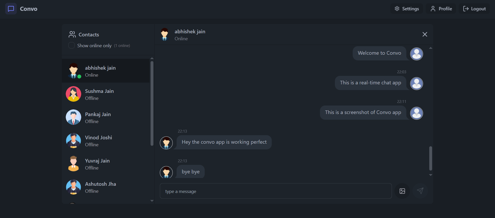

# ✨ Convo - Realtime Chat App ✨

#### Project Summary
**Convo** is a real-time messaging application that enables users to communicate instantly and seamlessly.Built with modern web technologies, it allows users to send messages, and 
engage in conversations with minimal delay. The app leverages Socket.io to establish a persistent connection between users, ensuring real-time message delivery.
---

## 🌟 Live Preview

Check out the live version of my app:
[🔗 View Project](https://convo-lzv5.onrender.com/)

## 📸 App Preview




Highlights:

- 🌟 Tech stack: MERN + Socket.io + TailwindCSS + Daisy UI
- ✨ Authentication && Authorization with JWT
- ⏳ Real-time messaging with Socket.io
- 🚀 Online user status
- ⭐ Global state management with Zustand
- 🐞 Error handling both on the server and on the client


### Setup .env file

```js
MONGODB_URL=...
PORT=3000
JWT_SECRET=...

CLOUDINARY_CLOUD_NAME=...
CLOUDINARY_API_KEY=...
CLOUDINARY_API_SECRET=...

NODE_ENV=development
```

### Build the app

```shell
npm run build
```

### Start the app

```shell
npm start
```
---

## 🔥 Contributing

## Feel free to fork this repository, open issues, or submit pull requests.

💙 Made with passion by **Abhishek Jain**

